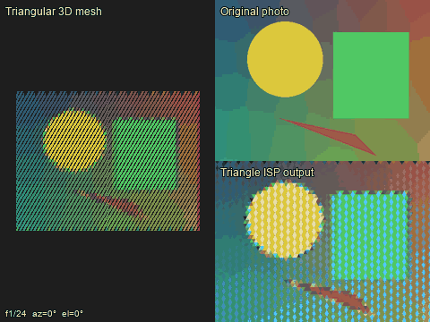
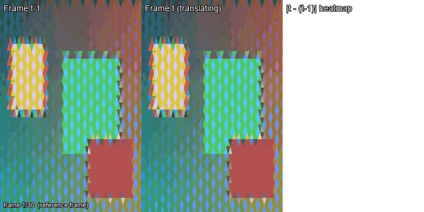

# Triangle Pixel — 三角网格视觉系统

**用等边三角形网格替代矩形像素网格的完整计算机视觉管线。**

从传感器物理模拟到 AI 推理，端到端的三角原生处理。
无需 Bayer 滤波器，无需传统 ISP，无需矩形 CNN。

## 核心理念

```
传统视觉:  Bayer RAW → ISP → RGB → 矩形CV → 结果
三角视觉:  三角RAW → GCN → RGB → 三角CV → 结果
                  ↘ 零计算六边形 → 人眼直出
                  ↘ Sierpinski → 无限超分
                  ↘ 三角面片 → 3D原生
```

## 快速开始

```bash
# 安装依赖
pip install pillow numpy numba matplotlib

# 启动 GUI（15种模式）
python triangle_pixel_gui.py

# 或跑完整 demo
python demo.py
```

> **论文**: [paper.pdf](https://raw.githubusercontent.com/kieran576/triangle-pixel/main/paper.pdf) — 已编译 PDF
> **代码**: [github.com/kieran576/triangle-pixel](https://github.com/kieran576/triangle-pixel)

## 演示视频

| 演示 | 内容 | 文件 |
|------|------|------|
| **3D 网格旋转** | 三角 mesh 旋转 + 原图 vs ISP 输出对比 | `demo_video_small.gif` (767 KB) |
| **时序一致性（静态）** | 30 帧静态场景，帧差热力图全白 | `demo_temporal_static.gif` (1.6 MB) |
| **时序一致性（平移）** | 30 帧平移场景，差值仅集中在运动边缘 | `demo_temporal_translating.gif` (1.1 MB) |



*左半：旋转中的三角 3D mesh / 右上：原图 / 右下：三角 ISP 重建结果。*


*Section 8.4 实证 #1：30 帧静态场景，每帧 t 减去 t-1，**帧差热力图全部为白色（≈0）**——验证 ISP 在无运动时**逐帧位精确**。*



*Section 8.4 实证 #2：30 帧水平平移场景，帧差热力图**仅在运动边缘出现红色**，背景保持白色——验证 ISP 引入零伪影，所有帧间变化都对应真实场景变化。*

## 系统架构

```
┌────────────────────────────────────────────────────────┐
│                   triangle_pixel_gui.py                │
│                     (15 modes)                         │
├────────────────────────────────────────────────────────┤
│  L1-L3 ISP     │  Phase 2 CV    │  Phase 3-5 AI/3D    │
│  triangle_     │  triangle_cv   │  triangle_features  │
│  engine.py     │  .py           │  .py                │
│  engine_fast   │                │  triangle_3d.py     │
│  .py (numba)   │                │  triangle_ai.py     │
│                │                │  demosaic_ai.py     │
├────────────────────────────────────────────────────────┤
│  传感器/仿真                                         │
│  triangle_sensor.py   triangle_superres.py            │
│  triangle_sierpinski.py                                │
├────────────────────────────────────────────────────────┤
│  测试/基准                                            │
│  benchmark.py → BENCHMARK.md                          │
└────────────────────────────────────────────────────────┘
```

## 15 种 GUI 模式

| 模式 | 功能 | 阶段 |
|------|------|------|
| RAW 马赛克 | 单通道三角纯色 (零计算) | L1 |
| RAW 降采样 | 六边形→矩形像素 | L1 |
| 邻居借用 | 3邻域借通道→全彩 | L2 |
| 双边校正 | 比值平滑校正 | L3 |
| ISP 去伪色 | 三角原生去伪色 | L3 |
| Sierpinski | 剖分线可视化 | L4 |
| 超分 2× / 4× | Sierpinski 超分辨率 | L4 |
| CV 亮度 | 单通道→亮度估计 | P2 |
| CV 边缘 | 三角 Canny 等价 | P2 |
| CV 多尺度边缘 | Sierpinski 金字塔边缘 | P2 |
| CV 特征点 | Tri-Harris 角点 | P3 |
| 3D 视图 | 三角网格→3D 渲染 | P4 |
| AI 去噪 | GCN 去噪 | P5 |
| AI 直出RGB | 端到端 GCN 去马赛克 | P5 |
| 传感器对比 | 三角 vs Bayer 模拟 | 仿真 |

## 核心基准数据

### 传感器效率 (S=12, 仅 2% 数据量 vs Bayer, 8 测试图)

| 测试图 | TRI PSNR | TRI SSIM | Bayer PSNR | Bayer SSIM |
|--------|----------|----------|-----------|-----------|
| Edge 0° (对齐) | 27.4 dB | 0.947 | 38.7 dB | 0.952 |
| Edge 45° | 25.5 dB | 0.941 | 39.2 dB | 0.952 |
| Edge 90° | 24.7 dB | 0.936 | 37.9 dB | 0.951 |
| Edge 135° | 25.3 dB | 0.939 | 39.1 dB | 0.952 |
| Color R→B | 38.7 dB | 0.953 | 42.7 dB | 0.960 |
| Gray Ramp | 37.0 dB | 0.931 | 41.9 dB | 0.949 |
| Siemens Star | 19.0 dB | 0.485 | 25.1 dB | 0.833 |
| Real Photo | 24.9 dB | 0.874 | 38.8 dB | 0.950 |
| **平均** | **27.8 dB** | **0.876** | **37.9 dB** | **0.937** |

**观测**:
- 0° 边缘因与三角网格水平轴对齐，比其它三个方向高 ~3 dB
- 其它三个方向之间仅 0.8 dB 差异，确认 6 重对称
- 渐变图 (Gray Ramp, Color R→B) 保持 >37 dB——平滑区域接近无损
- 高频 (Siemens Star) 是共同瓶颈：三角 19.0 / Bayer 25.1 dB

### 处理速度 (numba 加速, CPU)

| 三角边长 | 三角数 | 耗时 | FPS |
|---------|--------|------|-----|
| S=16 | 1,219 | 17ms | 59 |
| S=20 | 817 | 12ms | 85 |
| S=24 | 576 | 8ms | 121 |
| S=32 | 336 | 5ms | 203 |

### AI vs 手工 ISP

| 测试图 | AI PSNR | ISP PSNR |
|--------|---------|----------|
| 边缘 | 24.7 dB | 25.1 dB |
| 渐变 | 20.5 dB | 36.4 dB |
| 色块 | 11.9 dB | 14.7 dB |

AI 在边缘图上接近手工 ISP（差 0.4 dB）。渐变图上 ISP 优势大，因为有强先验。

## 文件清单

| 文件 | 功能 | 行数 |
|------|------|------|
| `triangle_engine.py` | RAW/BORROW/ISP | 590 |
| `triangle_engine_fast.py` | numba 加速 (~54×, 需单独调用 `process_fast`) | 290 |
| `triangle_cv.py` | 边缘检测/多尺度 | 320 |
| `triangle_features.py` | Harris/16D描述子/匹配 | 440 |
| `triangle_3d.py` | 3D mesh/OBJ导出 | 290 |
| `triangle_ai.py` | GCN 去噪 | 350 |
| `triangle_demosaic_ai.py` | 端到端 AI 去马赛克 | 320 |
| `triangle_superres.py` | Sierpinski 超分 | 310 |
| `triangle_sensor.py` | 传感器模拟器 | 300 |
| `triangle_sierpinski.py` | 剖分几何 | 280 |
| `benchmark.py` | 基准测试套件 | 310 |
| `demo.py` | 一键 demo | — |
| `triangle_pixel_gui.py` | GUI (15 modes) | 490 |
| **总计** | **~4800 行** | |

## 已知限制 (Limitations)

来自 `PAPER.md` §8.2 的关键限制:

1. **三角边长 < 4 px 时**: 邻居通道分配规则 (5×5 pattern) 退化为伪随机; 推荐 `triangle_side ≥ 8`.
2. **边缘三角形**: 当前统一用零填充 (邻居缺失通道=0), 表现为黑色镶边;
   推荐先 `pad_to_multiple` 或裁掉 1 行/列.
3. **极端高对比度场景**: borrow 模式会产生拉链伪影, 需 `correct_isp` 才能去除;
   correct_isp 模式比 borrow 慢 ~10×.
4. **APK 模式 2 实际等同 mode 1**: `MainActivity.kt:215` 把 ISP 模式映射到 borrow,
   移动端目前没有真正的 ISP 校正路径 (修复中).
5. **GCN 模型无法导出 ONNX**: 依赖 `torch_geometric` 的稀疏算子,
   移动端只能用 PyTorch Mobile 部署.
6. **`compute_ssim` 现在使用真 SSIM**: 历史 benchmark 数据若 SSIM > 0.99 应视为
   旧版全局近似的"亮度相似度", 不可与新数据直接比较 — 需重跑 benchmark.
7. **Numba 加速未自动启用**: `triangle_engine.process_pipeline` 仍走纯 Python;
   要获得 ~54× 加速, 需直接调用 `triangle_engine_fast.process_fast`.

## 论文图表索引

论文 (`arxiv_submission/paper.tex`) 使用的所有图表，按出现顺序：

| # | 标签 | 文件 | 内容 |
|---|------|------|------|
| 1 | fig:grid | `arxiv_submission/fig1_grid.pdf` | 三角网格 + 邻居通道分配规则 |
| 2 | fig:channels | `arxiv_submission/fig2_channels.pdf` | L1/L2/L3 通道合成示意 |
| 3 | tab:sensor | (Table 1, 内嵌) | 8-image 三角 vs Bayer PSNR 表 |
| 4 | fig:sensor | `arxiv_submission/fig3_sensor_bars.pdf` | PSNR 柱状图 |
| 5 | fig:aniso | `arxiv_submission/fig4_anisotropy.pdf` | 定向各向异性雷达图 |
| 6 | fig:ai_speed | `arxiv_submission/fig5_ai_speed.pdf` | AI 去噪训练曲线 + 推理速度 |
| 7 | fig:arch | `arxiv_submission/fig6_arch.pdf` | 端到端管线架构图 |
| 8 | fig:temporal_static | `demo_temporal_static.gif` | 静态场景时序一致性 GIF |
| 9 | fig:temporal_translating | `demo_temporal_translating.gif` | 平移场景时序一致性 GIF |

## 引用

如果这个项目对你的研究有帮助：

```bibtex
@misc{wang2025triangle,
  title   = {Triangle Pixel: A Triangular-Grid Vision System},
  author  = {Kieran Wang},
  year    = {2025},
  eprint  = {XXXX.XXXXX},
  archivePrefix = {arXiv},
  note    = {arXiv:XXXX.XXXXX}
}
```

> 论文全文: [arxiv_submission/paper.tex](arxiv_submission/paper.tex)
> 编译: 上传 `arxiv_submission/` 到 [Overleaf](https://overleaf.com)

## 许可证

MIT
